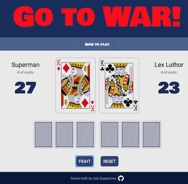

# WAR: The card game
This is the popular card game **War**, that I created for a project in my software engineering course.

## Game play images

 

## Technologies Used
1. HTML
2. CSS
3. JavaScript

## Getting Started (How to play)
*Link to video instructions are below and also in the 'How to Play' section of the website*

+ Cards and player names are dealt automatically at start of game

+ click FIGHT button to deal hand

+ Player who has highest card (ranked: 2-A) wins hands and the cards

+ The score will be updated and shows number of cards a player has in their own deck

+ If cards are of equal value, a "tie arena" will appear with 3 additional cards dealt face down from each player.

+ Click FIGHT to deal next hand and all cards are displayed. Winner wins all cards displayed

+ If a player does not have enough cards to play a tie hand, the value of the card will then be ranked by suit (hearts, diamonds, clubs, spades)

+ When one player has no cards a winner will be decided and it will be displayed on screen

+ To play again (or to reset game in middlbe of play), click the reset button

## Next Steps
I am currently working on making this game so that it can be played on mobile. 

While it was not a requirement of this project I know it's best practice to design for mobile first and then use responsive design to scale up. However, for the next iteration I'll be scaling down.

