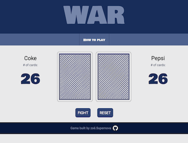

# WAR: The card game
This is the popular card game **War**, that I created for a project in my software engineering course.

## Game play images

---
#### Start of game
 

----
#### Game in play
 

----
#### Game play for a tie

----
#### Result of tie

----
#### Winner

----

## Technologies Used
1. HTML
2. CSS
3. JavaScript

## Getting Started (How to play)
<a href="https://zsiskos.github.io/card-game-war/" target="_blank">Click here to play the game.</a>

+ Cards and player names are dealt automatically at start of game

+ click **FIGHT** button to deal a hand

+ Player who has highest card (*ranked: A high, 2 low*) wins the hand and the cards

+ The score updates and shows number of cards a player has in their own deck

+ If cards are of equal value, a *tie arena* will appear with 3 additional cards dealt face down from each player.

+ Click **FIGHT** to deal next hand and display all cards. Player who has highest card in main play area wins all cards displayed

+ If a player does not have enough cards to play a tie hand, the value of the card will then be ranked by suit (*hearts, diamonds, clubs, spades*)

+ When one player has no cards a winner will be decided and it will be displayed on screen (*the fight button will be removed*)

+ To play again (or to reset game in middle of play), click the reset button

*A video of instructions is linked in the 'How to Play' section on the website*

## Next Steps
I am currently working on making this game so that it can be played on mobile. 

It's typically best practice to design for mobile first and then use responsive design to scale up. However, since this was not a requirement for the project I will be scaling for mobile from what I already have.

